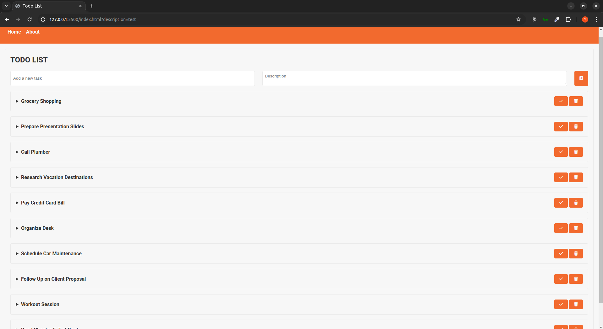

# Todo List Web Application

This repository contains a simple Todo List web application developed by Yousif Paulus. It allows users to manage tasks effectively, add descriptions, mark tasks as completed, and persist data using `localStorage`. This README provides an overview of the application, its features, technologies used, setup instructions, and more.

## Screenshots

### Home Page


### About Page


## Features

- **Task Management**: Add new tasks with descriptions.
- **Task Completion**: Mark tasks as completed or uncompleted.
- **Persistent Storage**: Utilizes `localStorage` to save tasks locally.
- **Dynamic UI**: Tasks are dynamically rendered and updated in the UI.
- **Delete All**: Option to delete all tasks at once.

## Technologies Used

- **HTML**: Structure of the web application.
- **CSS**: Styling using custom properties and Google Fonts.
- **JavaScript**: Functionality for task management and dynamic rendering.
- **Font Awesome**: Icons for buttons and task controls.

## Changelog

### v1.0.0 (July 2024)

- Initial release of the Todo List application.
- Basic functionality implemented:
  - Adding tasks with descriptions.
  - Marking tasks as completed.
  - Deleting individual tasks.
  - Deleting all tasks at once.
  - Persisting tasks using `localStorage`.

## Installation and Setup

To run the Todo List application locally:

1. Clone the repository:
   ```bash
   git clone https://github.com/yousifpa98/todo-list_js.git
2. Navigate to the project directory
    ```bash
    cd todo-list_js
3. Open `index.html` in your preferred web Browser. 

#### Otherwise:

open [this link](https://yousifpa98.github.io/todo-list_js/) for a hosted web version.


## Usage

- **Adding a Task**:
    Enter a task in the input field and optionally add a description. Click on the 'Add Task' button.
- **Completing a Task**:
    Click on the checkmark button next to a task to mark it as completed.
- **Deleting a Task**:
    Click on the trash can button to delete a specific task.
- **Deleting all Tasks**:
    Click on the 'Delete All' button to remove all tasks from the list.


## About this Application

Hello! I'm Yousif, a web developer who created this application as a fun project to experiment with GitHub Copilot while on a train journey. This simple yet functional app serves as a quick demonstration of what GitHub Copilot can do. It really feels like coding on autopilot.

## Key Functionalities

- **Todo List Management**:
    Easily add tasks with descriptions, track them, and mark them as completed.
- **Persistent Storage**:
    Utilizes `localStorage` to save your tasks locally, ensuring they persist even when you close or refresh the page.
- **Dynamic Rendering**:
    Tasks are dynamically rendered in the UI, providing an up-to-date view of your todos.

## Technology Stack

Built with HTML, CSS (styled with custom properties and Google Fonts), and JavaScript.

## Credits

- **Developed by [Yousif Paulus](https://www.yousifpaulus.dev/)**
- **&copy; 2024 Yousif Paulus**

##

For more details, visit the [project repository](https://github.com/yousifpa98/todo-list_js)